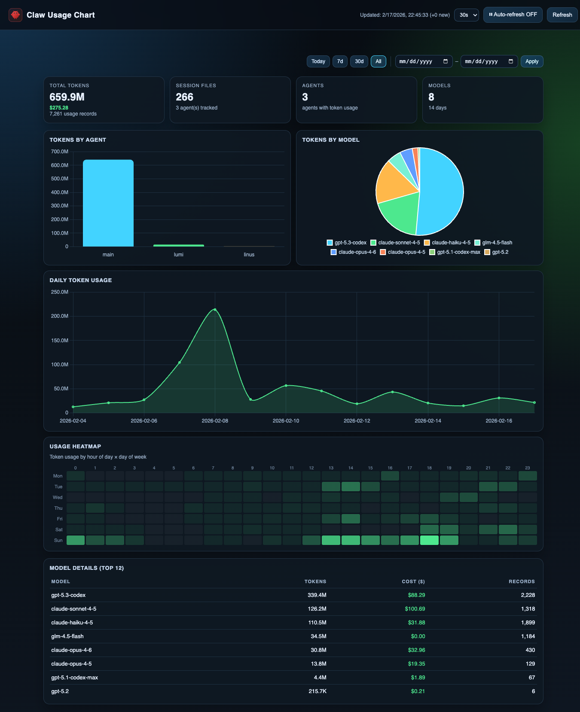

# Claw Usage Chart

A lightweight local web dashboard for visualizing your [OpenClaw](https://github.com/openclaw/openclaw) token usage and API costs.



## Features

- **Fast** — SQLite incremental cache keeps responses ~30 ms even after months of data
- **Single binary** — ships as one self-contained executable, no runtime needed
- **Live auto-refresh** — configurable interval (10s / 30s / 1m / 5m)
- **Date filters** — Today / 7d / 30d / All, or custom range
- **Per-agent & per-model breakdown** — tokens, cost, record count
- **Daily token trend chart**
- **Usage heatmap** — token activity by hour of day × day of week

## Requirements

- Go 1.22+ (to build)
- OpenClaw installed and used at least once (session files in `~/.openclaw/agents/`)

## Quick Start

```bash
git clone https://github.com/yeremiel/claw-usage-chart.git
cd claw-usage-chart
go build -o claw-usage-chart .
./claw-usage-chart
```

Then open http://localhost:8585 in your browser.

## Configuration

All settings are via environment variables — no config file needed.

| Variable | Default | Description |
|---|---|---|
| `OCL_PORT` | `8585` | TCP port to listen on |
| `OCL_HOST` | `0.0.0.0` | Bind address |
| `OCL_AGENTS_DIR` | `~/.openclaw/agents` | Path to OpenClaw agents directory |
| `OCL_DB_PATH` | `<binary dir>/usage_cache.db` | Path to SQLite cache file |

Example:

```bash
OCL_PORT=9000 OCL_AGENTS_DIR=/custom/path ./claw-usage-chart
```

## How It Works

On every `/api/stats` request the server:

1. Checks each JSONL session file for newly-appended bytes (via stored byte offset)
2. Parses only the new lines and inserts them into SQLite
3. Aggregates from SQLite and returns JSON — no full re-scan

The first run builds the cache (a few seconds). Every subsequent call is fast regardless of how much historical data has accumulated.

The dashboard UI (`index.html`) and icon (`favicon.svg`) are embedded directly in the binary at build time — no extra files needed at runtime.

## Keep It Running (macOS)

Create a launchd plist at `~/Library/LaunchAgents/com.openclaw.usage-dashboard.plist`:

```xml
<?xml version="1.0" encoding="UTF-8"?>
<!DOCTYPE plist PUBLIC "-//Apple//DTD PLIST 1.0//EN"
  "http://www.apple.com/DTDs/PropertyList-1.0.dtd">
<plist version="1.0">
<dict>
  <key>Label</key>
  <string>com.openclaw.usage-dashboard</string>
  <key>ProgramArguments</key>
  <array>
    <string>/path/to/claw-usage-chart</string>
  </array>
  <key>RunAtLoad</key>
  <true/>
  <key>KeepAlive</key>
  <true/>
  <key>StandardOutPath</key>
  <string>/tmp/openclaw-dashboard.log</string>
  <key>StandardErrorPath</key>
  <string>/tmp/openclaw-dashboard.err</string>
</dict>
</plist>
```

Then load it:

```bash
launchctl load ~/Library/LaunchAgents/com.openclaw.usage-dashboard.plist
```

## File Structure

```
claw-usage-chart/
├── main.go       HTTP server + embedded static files
├── db.go         SQLite incremental cache layer
├── parser.go     JSONL parser / usage extractor
├── index.html    Dashboard UI (Chart.js) — embedded in binary
├── favicon.svg   OpenClaw icon — embedded in binary
├── go.mod
└── .gitignore
```

## License

MIT

---

> Vibe-coded with [OpenClaw](https://github.com/openclaw/openclaw) 🤖 — README and all.
